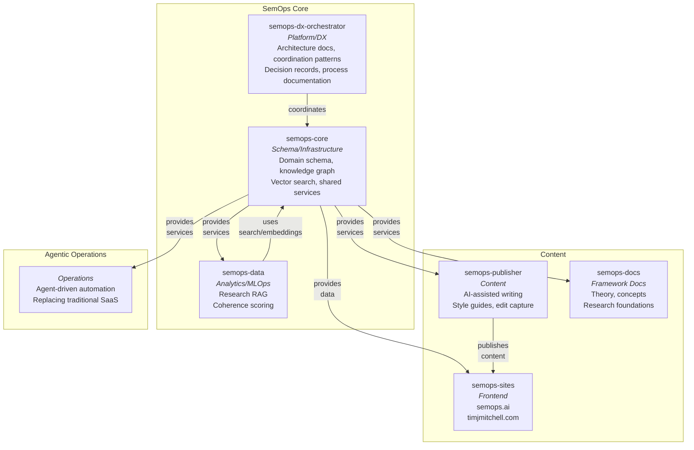
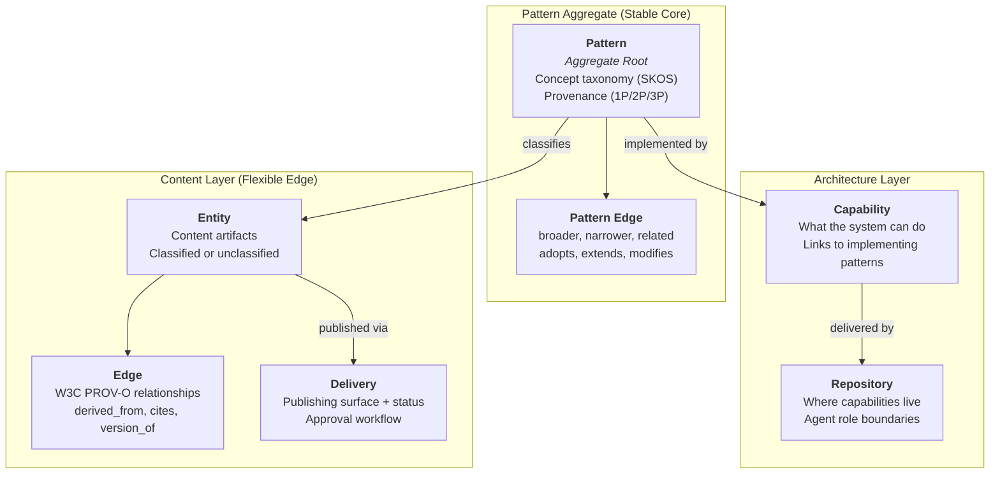
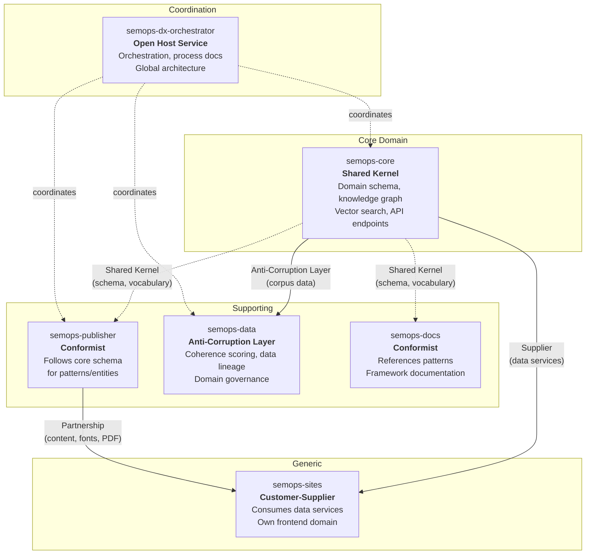

# semops-dx-orchestrator

System orchestration, architecture documentation, and cross-repo coordination for the [SemOps](https://semops.ai) multi-repo system.

## What This Is

This repo is the **architectural home** for Semantic Operations (SemOps) — a multi-repo system that tests the thesis that shared [Semantic Coherence](https://github.com/semops-ai/semops-docs/blob/main/SEMANTIC_OPERATIONS_FRAMEWORK/SEMANTIC_OPTIMIZATION/semantic-coherence.md) enables better human+AI collaboration.

It contains the system-level documentation, architecture, infrastructure, and coordination patterns that govern six domain-specific repos. It orchestrates how they work together and why, including a lineage of decisions of how I got here. If you want to understand how the system is designed and why, start here.

**All repos in Semops-ai are a reference implementation.** They demonstrate how Semantic Operations could be implemented, with a multi-repo system that illustrates the framework principles of [Symbiotic Architecture](https://github.com/semops-ai/semops-docs/blob/main/SEMANTIC_OPERATIONS_FRAMEWORK/SYMBIOTIC_ARCHITECTURE/README.md) (Domain-Driven Design), and [Semantic Optimization](https://github.com/semops-ai/semops-docs/blob/main/SEMANTIC_OPERATIONS_FRAMEWORK/SEMANTIC_OPTIMIZATION/README.md), with AI agents as first-class participants at organization scale. You are welcome to study the architecture, adapt patterns, and learn from the decisions — but this is not a library to install or a service to deploy.

**What this repo is NOT:**

- Not a general-purpose orchestration framework
- Not a drop-in solution — it reflects one specific environment
- Not documentation for SemOps concepts (see [semops.ai](https://semops.ai) for that)
- Not a monorepo — it coordinates independent repos, each with its own bounded context

## System Context

SemOps is organized as six repos, each scoped to an agent role boundary — a focused context that gives an AI agent (or human) what it needs to do useful work without drowning in the full system.

The system has three logical layers. **SemOps Core** is the reusable engine — process coordination, schema and infrastructure services, and coherence measurement. It is domain-agnostic. **Content** is the first domain application built on it — publishing, framework documentation, and frontends. **Agentic Operations** is the third — agent-driven automation replacing traditional SaaS tools with scriptable, composable alternatives (attention management, financial pipelines, voice control). Both domain layers could be replaced entirely while the core engine remains unchanged.

**Why repos, not a monorepo?** Each repo is an agent role boundary — not a DDD subdomain boundary, but an organizational boundary that scopes what an AI agent needs in context to do useful work. A content agent working in Publisher has style guides, writing tools, and edit capture. A data agent working in Data has notebooks, pipelines, and coherence tooling. Neither needs the other's full context.

## How to Read This Repo

**If you want to understand the architecture:**
Start with the system overview below, then look at the [Architecture Decisions](#key-decisions) section for the reasoning behind major choices.

**If you want to see how the repos relate:**
The [Repo Map](#repo-map) shows what each repo owns and its bounded context, and the [Integration Patterns](#how-repos-integrate) section explains how data and work flow between them.

**If you want to study specific patterns:**
Jump to [Ideas Worth Studying](#ideas-worth-studying) for the architectural ideas we think are most transferable.

**If you're coming from [semops.ai](https://semops.ai) and want implementation details:**
The website explains *what* Semantic Operations is and *why* it matters. This repo explains *how* the system is built — the architecture, tooling choices, and design principles behind the implementation.

## Architecture Overview

### The Core Thesis

Most of SemOps is not about AI. It is about creating the **conditions** that let AI deliver real value — and those conditions turn out to be things organizations should build regardless: explicit meaning, coherent data, clear ownership boundaries, and structured decision-making. Three of the four framework pillars are valuable whether or not you deploy a single agent.

Those conditions require **architecture** — specifically, a cohesive Domain-Driven Design structure that scaffolds a high-structure, expanding corpus of data ([Strategic Data](https://github.com/semops-ai/semops-docs/blob/main/SEMANTIC_OPERATIONS_FRAMEWORK/STRATEGIC_DATA/README.md)) for AI agents to operate against. The more coherent and structured the data, the more effectively agents can interpret, classify, and act on it.

Architecture is not infrastructure. Architecture *drives* infrastructure — and for agents, the ideal infrastructure is open, un-abstracted, and inspectable. SaaS platforms optimize for human point-and-click; agents need scriptable interfaces, plain-text artifacts, and composable primitives. The [Symbiotic Enterprise](https://github.com/semops-ai/semops-docs/blob/main/SEMANTIC_OPERATIONS_FRAMEWORK/SYMBIOTIC_ARCHITECTURE/symbiotic-enterprise.md) pattern inverts the traditional approach: instead of picking platforms and contorting architecture to fit, architecture defines data structures and infrastructure serves the architecture.

**The implication:** A multi-repo system built on open primitives (git, markdown, YAML, SQL, open-source databases) with no proprietary abstractions may not just be a reference model — it may be closer to an ideal operating model for AI agents at organizational scale. The same tools that make agentic coding effective in a single repo (bounded context, explicit contracts, structured text) are what make [agentic enterprise operations](https://github.com/semops-ai/semops-docs/blob/main/SEMANTIC_OPERATIONS_FRAMEWORK/SYMBIOTIC_ARCHITECTURE/symbiotic-enterprise.md) effective across an organization. This system tests that thesis.

### Design Principles

**Pattern as aggregate root.** The system uses Domain-Driven Design with one key adaptation: the aggregate root is a [Pattern](https://github.com/semops-ai/semops-docs/blob/main/SEMANTIC_OPERATIONS_FRAMEWORK/SEMANTIC_OPTIMIZATION/patterns.md) — a semantic structure with enough self-contained meaning to be recognized and operated on as a whole, by both humans and machines. Patterns are the right granularity for AI: standard patterns (3p) already exist in LLM training data as canonical forms, so adoption is rapid; first-party patterns (1p) represent organizational innovations with tracked deviations from those baselines. Everything in the system — capabilities, content, entities — links back to patterns, measured for [semantic coherence](https://github.com/semops-ai/semops-docs/blob/main/SEMANTIC_OPERATIONS_FRAMEWORK/SEMANTIC_OPTIMIZATION/semantic-coherence.md) and traced through provenance chains.

**Repos simulate organizational roles.** This architecture applies the [Symbiotic Enterprise](https://github.com/semops-ai/semops-docs/blob/main/SEMANTIC_OPERATIONS_FRAMEWORK/SYMBIOTIC_ARCHITECTURE/symbiotic-enterprise.md) pattern — structuring an organization the way you'd structure a well-maintained codebase. In a larger organization, you'd have teams with clear ownership boundaries — a data team, a content team, a platform team. These repos mirror that structure at small scale, each owning a coherent set of capabilities. The same architectural choices that let an AI coding agent work effectively in a single repo (bounded context, explicit contracts, structured artifacts) are what let AI agents work effectively across organizational boundaries.

**Subdomains cut across repos.** The repos are not subdomain boundaries. Semantic Operations as a domain spans Core, Data, and Docs. Content Publishing spans Publisher, Sites, and Docs. A single repo participates in multiple subdomains, and a single subdomain spans multiple repos. This is intentional — it mirrors how real organizational capabilities cross team boundaries.

### Three-Layer Domain Model

The domain model is organized into three layers, each serving a different purpose:

| Layer | What It Contains | Purpose |
| ----- | --------------- | ------- |
| **Pattern** (Core) | Concept taxonomy, adoption relationships | The stable semantic core everything traces to |
| **Architecture** (Strategic) | Capabilities, repositories, integration patterns | How capabilities implement patterns and how repos deliver capabilities |
| **Content** (Publishing) | Publishing artifacts, delivery surfaces, provenance | Artifacts with full provenance tracking across publishing surfaces |

The Pattern layer is intentionally stable — it changes slowly and deliberately. The Content layer is intentionally flexible — new content flows through continuously. The Architecture layer mediates between them.

**Stable Core vs. Flexible Edge:** Entities with an assigned pattern are classified (stable). Entities without a pattern assignment are unclassified (flexible edge) — awaiting classification through the coherence workflow. This is how new content enters the system and gradually becomes structured knowledge.

## Repo Map

Each repo has a bounded context — a clear ownership boundary that determines what belongs there and what doesn't. The table below describes **architecture** — what each repo owns, its domain role, and capability boundaries. Infrastructure concerns (services, databases, deployment topology) are deliberately separate: each repo's infrastructure serves its architecture, not the other way around.

| Repository | Role | Architecture (Capabilities) |
| ---------- | ---- | --------------------------- |
| [semops-dx-orchestrator](https://github.com/semops-ai/semops-dx-orchestrator) | Platform / DX | Architecture governance, coordination patterns, decision records, process documentation |
| [semops-core](https://github.com/semops-ai/semops-core) | Schema / Infrastructure | Domain schema (Pattern as aggregate root), knowledge graph, semantic search, query API, corpus routing |
| [semops-publisher](https://github.com/semops-ai/semops-publisher) | Content | AI-assisted writing for multiple surfaces, style guides, edit capture for style learning |
| [semops-docs](https://github.com/semops-ai/semops-docs) | Framework Docs | SemOps framework theory, concept documentation, research foundations |
| [semops-data](https://github.com/semops-ai/semops-data) | Analytics / MLOps | Research RAG pipelines, coherence scoring, data lineage, domain governance |
| [semops-sites](https://github.com/semops-ai/semops-sites) | Frontend | Public websites ([semops.ai](https://semops.ai), [timjmitchell.com](https://timjmitchell.com)), design system assets |

A third layer — **Agentic Operations** — handles agent-driven automation of functions traditionally served by SaaS platforms: attention management, financial pipelines, voice control. This layer consumes the same core services but is not published as a public repo.

### Ownership Rules

1. **Single ownership (DRY at the repo level):** Each capability has exactly one owning repo. Other repos reference or consume — they never maintain a second copy. When a deployment needs resources from multiple repos, each resource traces back to its owning repo.

2. **Process vs. Model split:** The Orchestrator owns *process* (how we work — architecture decisions, coordination patterns, governance). Core owns *model* (what we know — schema definitions, knowledge graph, semantic services). This separation prevents the orchestration layer from accumulating domain logic.

3. **Content routing:** Concept explanations and framework theory live on the [website](https://semops.ai) and in [semops-docs](https://github.com/semops-ai/semops-docs). GitHub repos document implementation — how the system works, what decisions were made, and what patterns are in play.

## How Repos Integrate

Repos interact through Domain-Driven Design integration patterns. The shared knowledge base (a relational database, vector store, and knowledge graph) is infrastructure accessible to any repo — these patterns describe how repos relate to the *domain model*, not the database.

**Integration pattern key:**

- **Open Host Service** — Context exposes well-defined services for others to consume (process docs, ADR templates, sync workflows)
- **Shared Kernel** — Both sides depend on the same schema and domain vocabulary
- **Partnership** — Two contexts co-evolve, coordinating releases and shared artifacts
- **Customer-Supplier** — Upstream provides services, downstream consumes
- **Conformist** — Downstream adopts upstream model as-is
- **Anti-Corruption Layer** — Downstream translates upstream model to protect its own domain (e.g., data governance)

### Infrastructure

The entire system runs locally on a single machine using containerized services. There is no cloud deployment, no remote API calls for core operations, and no SaaS dependencies for the knowledge base. This is intentional — agents work most effectively when infrastructure is local, inspectable, and has no authentication barriers between components.

**Shared services** (run via Docker Compose in semops-core):

- A relational database (Supabase/PostgreSQL; any Postgres-compatible service works) for structured data, schema, and the domain model
- A vector database (Qdrant; Weaviate, Milvus, and Pinecone serve the same role — we chose Qdrant for its lightweight footprint and gRPC support) for semantic search and embeddings
- A knowledge graph (Neo4j; alternatives include Amazon Neptune and TigerGraph) for relationship traversal and pattern navigation

**Why local-first?** Agents running on the same machine as the data have zero-latency access, no API keys to manage, and can inspect any service directly. The architecture scales to remote deployment by changing connection strings — the data flows, API contracts, and business logic remain identical.

**Tooling choices:** Python repos use small, focused libraries — not frameworks or platforms. Package management via uv (fast resolution matters when AI agents create environments frequently; Poetry and pip-tools are alternatives). Linting via ruff. No MCP servers or tool abstractions in the critical path — agents interact with the knowledge base through a thin query API and direct database access. The goal is minimal indirection between the agent and the data.

## Key Decisions

Architecture decisions are documented as ADRs (Architecture Decision Records) in each repo. Here are the most significant system-level decisions:

### 1. Repos as Agent Role Boundaries

**Decision:** Organize repos by agent role (what context an AI agent needs) rather than by DDD subdomain (what domain logic belongs together).

**Why:** In an AI-assisted workflow, the practical constraint is context window size and relevance. An agent working on content creation doesn't need knowledge graph schemas. An agent working on data pipelines doesn't need style guides. Repos scoped to agent roles give each agent a focused, relevant context.

**Trade-off:** Subdomains span multiple repos, which means cross-repo coordination is necessary for domain-level work. We accept this cost because the context focus benefit is significant — it's the difference between an agent that has what it needs and one that's drowning in irrelevant files.

### 2. Pattern as Aggregate Root

In Domain-Driven Design, an aggregate root is the central entity that other objects in the domain cluster around. In a typical business system, that might be an Order, a User, or a Product. In SemOps, it's a [Pattern](https://github.com/semops-ai/semops-docs/blob/main/SEMANTIC_OPERATIONS_FRAMEWORK/SEMANTIC_OPTIMIZATION/patterns.md).

A Pattern is a semantic structure with enough self-contained meaning to be recognized and operated on as a whole — by both humans and machines. Patterns are composable without loss (a "Sales Domain" pattern can contain "Customer", "Order", and "Product" patterns, each coherent independently), testable in context (once asserted, whether content fits can be measured), and the right granularity for AI (too atomic and LLMs lose context; too amorphous and they hallucinate structure).

Patterns carry a provenance split that determines how AI can help: **standard patterns** (3p — third-party) are proven solutions from external sources like [SKOS](https://www.w3.org/2004/02/skos/) (Simple Knowledge Organization System — a W3C standard for concept taxonomies and classification schemes), [PROV-O](https://www.w3.org/TR/prov-o/) (W3C provenance ontology — a standard for tracking origin, derivation, and attribution), or DDD itself. AI already knows their canonical forms, so adoption is rapid — the friction shifts from "can we implement this?" to "should we adopt this?" **Optimized patterns** (1p — first-party) are organizational innovations with tracked, intentional deviations from those baselines. AI must be more cautious with 1p patterns since they don't exist in training data. See [Pattern Operations](https://github.com/semops-ai/semops-docs/blob/main/SEMANTIC_OPERATIONS_FRAMEWORK/SEMANTIC_OPTIMIZATION/pattern-operations.md) for the promotion loop that governs how new patterns emerge from the flexible edge to the stable core.

**Decision:** Use Pattern as the aggregate root rather than traditional entities like User or Order.

**Why:** SemOps is fundamentally about meaning. Patterns are the stable semantic units that everything else traces to — capabilities implement patterns, content explains patterns, coherence is measured against patterns. Making Pattern the aggregate root means the domain model reflects what the system actually cares about.

**Trade-off:** This is unconventional. Most DDD implementations use business entities as aggregate roots. This works because SemOps is a knowledge system, not a transactional system — the "transactions" are meaning operations (classification, coherence measurement, provenance tracking), not CRUD operations.

### 3. Single Ownership (DRY at Repo Level)

**Decision:** Each capability has exactly one owning repo. No cross-repo duplication.

**Why:** Duplication drift is the silent killer of multi-repo systems. When two repos maintain copies of the same schema, template, or configuration, they inevitably diverge. Single ownership means there's always one source of truth. The cost is cross-repo dependencies; the benefit is never wondering which copy is current.

### 4. Process/Model Ownership Split

**Decision:** Separate process documentation (how we work) from domain model (what we know) into distinct repos.

**Why:** Process and model evolve at different rates and for different reasons. Architecture decisions, governance patterns, and coordination workflows change when the team or tooling changes. Schema definitions, knowledge structures, and semantic services change when the domain understanding changes. Coupling them means every domain change drags along process documentation and vice versa.

## Ideas Worth Studying

These are the architectural patterns we think are most interesting or transferable to other multi-repo systems:

### Lineage as a First-Class Concern

From the start, this system was designed with the assumption that provenance and lineage are critical to semantic operations — even before the tooling exists to automate them. Today, lineage is captured manually through two complementary practices:

**Session notes** are append-only logs organized by GitHub issue — one file per issue, new date sections appended for each work session. They record what context was available, what was done, and what comes next. In lineage terms, these are human episode logs: each session is an operation with inputs, outputs, and rationale. The pattern works because it's file-based (version-controlled, grep-able, no infrastructure dependency) and append-only (no merge conflicts, no lost context).

**Architecture Decision Records (ADRs)** capture decision provenance — why a particular approach was chosen, what alternatives were considered, and what trade-offs were accepted. Each repo maintains its own ADRs; the Orchestrator aggregates them into a cross-repo index. ADRs are append-only (superseded, never deleted), linked to GitHub issues, and include session logs for multi-session work.

These manual processes are deliberate scaffolding for what the system calls **Agentic Lineage** — tracking not just data flow, but *what context informed each agent decision and why you should trust it*. As the semantic operations loop matures, automated episode-centric provenance will capture the same information that session notes and ADRs capture by hand today: what patterns were retrieved, what model made the decision, what the coherence score was. The manual processes gradually become the HITL fallback for novel decisions rather than the primary record — but the data shape is the same from day one.

### Provenance-Driven Pattern Catalog

Knowing where something comes from — whether it's an established standard or an organizational innovation, and what changes were made — is central to how this system operates. Every pattern, entity, and decision carries provenance metadata that tracks its origin and evolution semantically, not just as a flag in a database.

The first 1p innovation layered on top of [SKOS](https://www.w3.org/2004/02/skos/) (W3C's Simple Knowledge Organization System) was a unified catalog of both third-party (3p) and first-party (1p) entities in the same knowledge graph. This isn't standard practice — most organizations either adopt external standards wholesale or build custom taxonomies from scratch. The SemOps catalog treats both as first-class patterns with the same semantic structure, but distinguishes them by provenance: 3p patterns have canonical external sources; 1p patterns have tracked deviations and organizational rationale for why they diverge.

This provenance distinction drives how AI operates on the system. For 3p patterns, AI can implement, validate, and optimize toward the canonical form — the model already knows what "correct" looks like. For 1p patterns, AI must defer to organizational context it hasn't seen. Tracking this semantically means the system can measure how far an implementation has drifted from its baseline and whether that drift is intentional innovation or unintentional divergence. Provenance metadata also flows through [PROV-O](https://www.w3.org/TR/prov-o/) (W3C provenance ontology) relationships in the content layer, connecting every artifact back to the patterns and decisions that produced it.

The [domain-patterns catalog](docs/domain-patterns/) in this repo documents each pattern with its provenance, relationships, and invariants — the concrete implementation of this idea.

### Semantic Coherence Measurement

The system measures how well content aligns with its source patterns using a three-pillar formula: **availability** (is the concept discoverable?), **consistency** (does the same concept mean the same thing across contexts?), and **stability** (has the meaning drifted over time?). Per-operation coherence scores create a feedback loop — content with higher coherence at publish time can be correlated with outcomes, creating an optimization signal. Multiple scoring approaches (embedding similarity, NLI contradiction detection, LLM-as-judge) are being tested experimentally.

### Edit Capture for Style Learning

The Publisher repo captures every editorial change made during human-in-the-loop (HITL) content refinement — recording what changed, why, and which style rule was applied. This creates a corpus of editorial decisions that can be analyzed to extract patterns and harden style guides. The system learns from disagreements between AI-generated content and human editorial judgment.

### Private-to-Public Translation

The system maintains private repos for operational work and publishes sanitized versions to public repos. The translation is not just redaction — it's a style transformation from machine-readable artifacts (agent instructions, port configurations, internal paths) to human-readable documentation (architecture explanations, pattern descriptions, decision rationale). This repo's public README is itself a product of that translation process.

### Research RAG with Provenance

The Data repo implements a research pipeline that uses retrieval-augmented generation (RAG) to synthesize information from multiple sources with full provenance tracking. Every claim traces back to its source — first-party content from the knowledge base or third-party citations from external sources. The pattern uses embedding-based clustering (inspired by RAPTOR) to discover themes across sources without requiring explicit questions.

## Status

| Component | Maturity | Notes |
| --------- | -------- | ----- |
| System architecture | Stable | Six-repo structure operational, boundaries validated through daily use |
| Domain model | Stable | Pattern as aggregate root, three-layer model in production |
| Knowledge base | Beta | Schema, vector search, and knowledge graph functional; API evolving |
| Content pipeline | Beta | Blog workflow operational, multi-surface publishing in progress |
| Research RAG | Beta | Functional with provenance, being extended to all content types |
| Manual lineage | Stable | Session notes and ADRs operational; scaffolding for agentic lineage |
| Agentic lineage | Planned | Episode-centric provenance model designed; implementation pending |
| Coherence scoring | Experimental | Three-pillar formula defined, multiple scoring approaches being tested |
| Public repo documentation | In Progress | You're reading the first version |

This is a single-person project in active development. The architecture is stable and used daily, but individual components range from production-quality to experimental. We're transparent about what works and what's still evolving.

## References

### Influences

- **Domain-Driven Design** (Eric Evans) — Bounded contexts, ubiquitous language, aggregate roots
- **SKOS** (W3C) — Simple Knowledge Organization System, used for pattern taxonomy
- **W3C PROV-O** — Provenance ontology, adapted for content and capability lineage
- **RAPTOR** (Sarthi et al.) — Recursive abstractive processing for tree-organized retrieval, adapted for research synthesis
- **AWS Security Reference Architecture** — Multi-repo reference implementation pattern (study, don't clone)

### Related

- **[semops.ai](https://semops.ai)** — Framework concepts, theory, and the case for Semantic Operations
- **[timjmitchell.com](https://timjmitchell.com)** — Blog, thought leadership, and project narrative
- **[semops-docs](https://github.com/semops-ai/semops-docs)** — Framework documentation — theory, concepts, and foundational research
- **[semops-core](https://github.com/semops-ai/semops-core)** — Schema, knowledge graph, and shared infrastructure services
- **[semops-publisher](https://github.com/semops-ai/semops-publisher)** — AI-assisted content creation and style governance

## License

[MIT](LICENSE)
