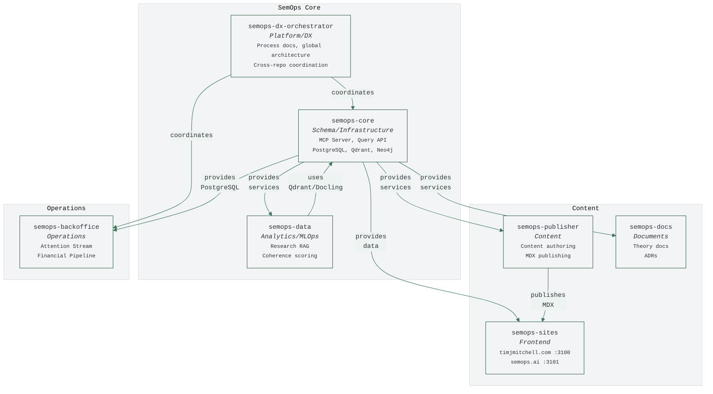
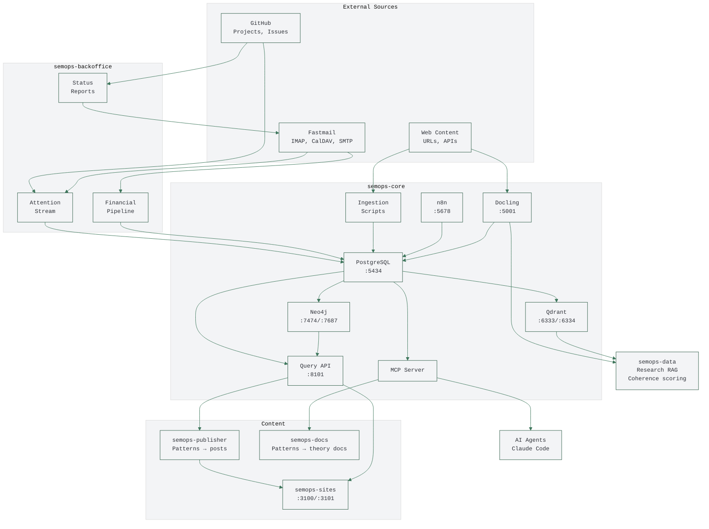
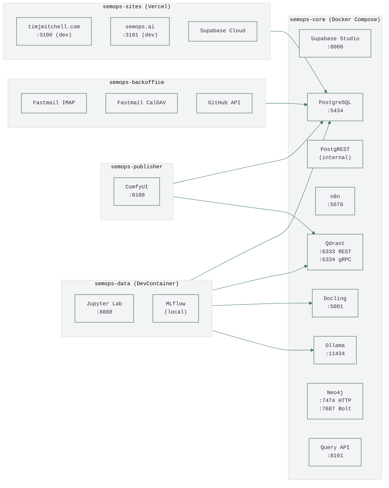
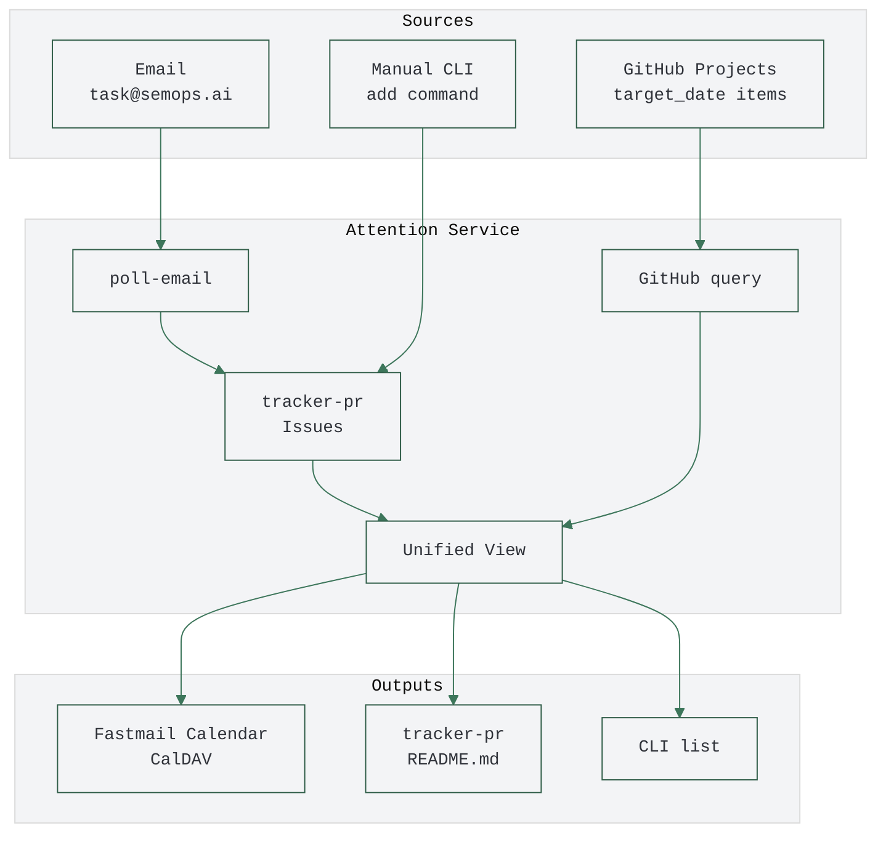
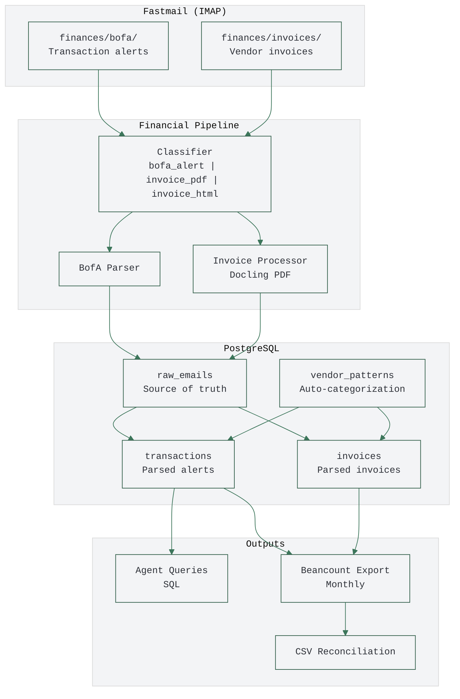
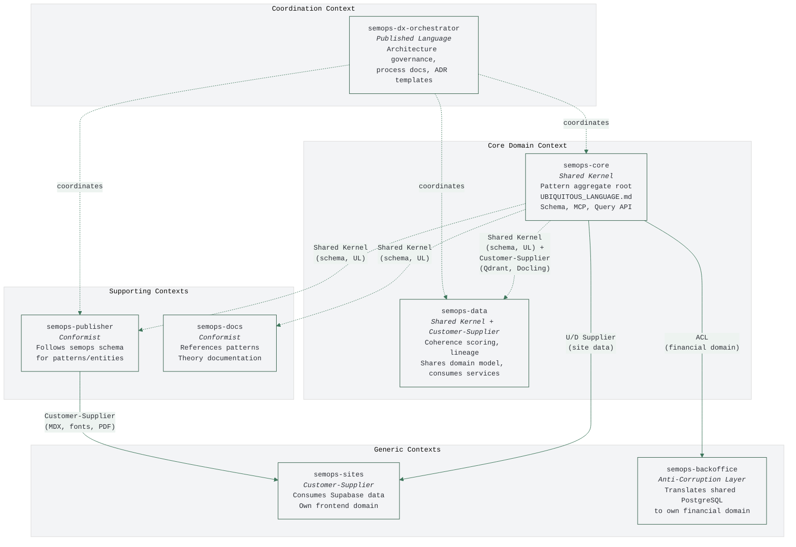
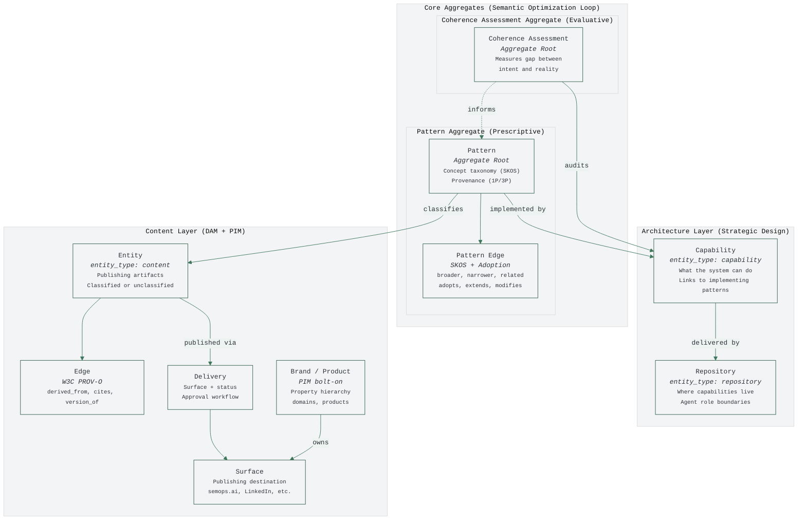
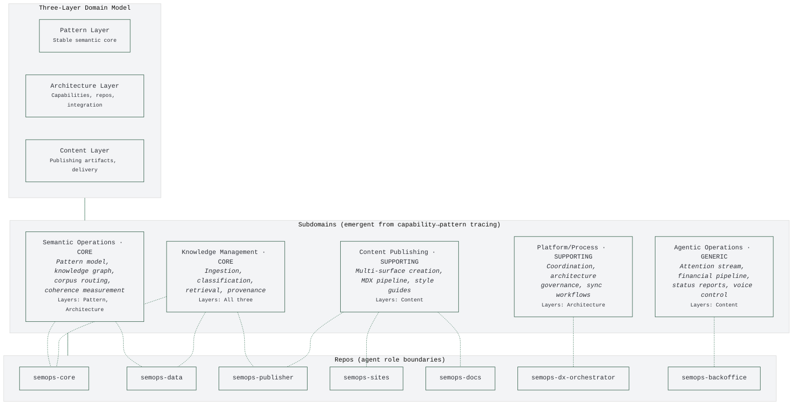

# SemOps System Diagrams

Visual representations of the SemOps architecture and data flows.

**Version:** 1.5.0
**Last Updated:** 2026-02-19

> **See Also:** [GLOBAL_ARCHITECTURE.md](GLOBAL_ARCHITECTURE.md) (ownership/relationships) | [GLOBAL_INFRASTRUCTURE.md](GLOBAL_INFRASTRUCTURE.md) (services/ports)

> **Style Guide:** [DIAGRAM_STYLE_GUIDE.md](DIAGRAM_STYLE_GUIDE.md) — palette, theme block, labeling rules. Derived from semops.ai site tokens.

---

## System Context

High-level view of repos and their relationships.

---

## Data Flows

How data moves through the system.

---

## Infrastructure Services

Service dependencies and ports.

---

## Attention Stream Flow

Backoffice-pr unified attention view.

---

## Financial Pipeline Flow

Backoffice-pr email-to-beancount automation.

---

## DDD Context Map

Integration patterns between repos. Note: repos are agent role boundaries, not bounded contexts (see [GLOBAL_ARCHITECTURE.md](GLOBAL_ARCHITECTURE.md#repos-as-agent-role-boundaries)). This diagram shows how repos access the shared domain model.

**Integration Pattern Key:**

- **Published Language** - Context defines a well-documented shared model for others to consume (e.g., global architecture, process docs, ADR templates)
- **Shared Kernel** - Both sides depend on same schema (UBIQUITOUS_LANGUAGE.md)
- **Customer-Supplier (U/D)** - Upstream provides services, downstream consumes
- **Conformist** - Downstream adopts upstream model as-is
- **ACL (Anti-Corruption Layer)** - Downstream translates upstream model to protect own domain (e.g., data governance)

---

## DDD Domain Model

Two co-equal core aggregates (Pattern + Coherence Assessment) forming the Semantic Optimization Loop (ADR-0012), with three architectural layers. Source: `semops-core/schemas/UBIQUITOUS_LANGUAGE.md` (v8.0.0) + `phase2-schema.sql` + `semops-core/docs/STRATEGIC_DDD.md`. All non-pattern entities share a single `entity` table with `entity_type` discriminator (`content`, `capability`, `repository`).

**Key model changes (v8.0.0 + ADR-0012):**

- **Two co-equal core aggregates** — Pattern (prescriptive) + Coherence Assessment (evaluative/directive), forming the Semantic Optimization Loop: Pattern pushes, Coherence aligns
- **Single entity table** with `entity_type` discriminator — not separate tables per layer
- **Architecture layer is new** — Capabilities (WHAT), Repositories (WHERE). Previously these were implicit.
- **Pattern types reduced** to `concept` and `domain` only — removed `architecture`, `topology`, `bounded-context`, `data-flow`, `system-landscape`
- **Subdomains are emergent** from capability→pattern tracing, not stored
- **Data flows are emergent** from shared capability participation, not explicitly modeled

**Bolt-on patterns (adopted 3P standards):**

- **DAM** (Digital Asset Management) — Content artifacts, surfaces, delivery workflow
- **PIM** (Product Information Management) — Brand/product hierarchy, property domains. Thin now but architecturally present for packaging and product relationships.
- **SKOS** — Pattern taxonomy (broader/narrower/related)
- **PROV-O** — Content provenance edges (derived_from, cites, version_of)

**Stable Core vs Flexible Edge:**

- **Stable Core** — Entities classified by a Pattern (the "classifies" edge exists)
- **Flexible Edge** — Unclassified entities awaiting pattern assignment
- **Promotion** — Assigning a pattern; **Rejection** — Deletion/archival

---

## DDD Subdomain Classification

Subdomains are **emergent from capability→pattern tracing**, not explicitly modeled or stored. They are cross-cutting capabilities that span multiple repos. Repos are **agent role boundaries** that participate in multiple subdomains. See [GLOBAL_ARCHITECTURE.md](GLOBAL_ARCHITECTURE.md#repos-as-agent-role-boundaries) for the full rationale.

**Key insight:** Subdomains are not modeled entities — they are emergent from capability→pattern tracing (query, don't store). Repos are agent-scoped workspaces that participate in one or more subdomains.

**Subdomain → Layer → Repo Participation:**

| Subdomain | Type | Primary Layer(s) | Repos | What It Covers |
|-----------|------|------------------|-------|--------------- |
| **Semantic Operations** | Core | Pattern, Architecture | semops-core, semops-data | Pattern model, knowledge graph, coherence scoring, corpus routing |
| **Knowledge Management** | Core | All three | semops-core, semops-data, semops-publisher | Ingestion, classification, retrieval, episode provenance, Research RAG |
| **Content Publishing** | Supporting | Content | semops-publisher, semops-sites, semops-docs | Multi-surface publishing, MDX pipeline, resume composition, theory docs |
| **Platform/Process** | Supporting | Architecture | semops-dx-orchestrator | Architecture governance, sync workflows, coordination |
| **Agentic Operations** | Generic | Content | semops-backoffice | Attention stream, financial pipeline, status reports, voice control |

**Why repos ≠ subdomains:**

- semops-data's coherence scoring is part of the **Semantic Operations** core domain, not a separate subdomain
- semops-publisher's pattern-based content creation participates in both **Knowledge Management** (reads patterns) and **Content Publishing** (creates deliveries)
- The shared knowledge base (PostgreSQL, Qdrant, Neo4j) is queryable by any repo or any future service on the Docker network

**Scale Projection:** The shared data layer means any new container/service can join the system by connecting to the same infrastructure. Repos are deployment-flexible — the architecture doesn't change when the deployment topology changes.

**Corpus Routing** (within Core Domain):

| Corpus | Schema Integration | Retention | Purpose |
|--------|-------------------|-----------|---------|
| `core_kb` | Full (Pattern + Entity + Edge) | Permanent | Curated knowledge |
| `deployment` | Entity + Edge | Permanent | Operational artifacts |
| `published` | Full + Delivery | Permanent | Published content |
| `research_*` | Entity only | Project-scoped | External research |
| `ephemeral_*` | Vectors only | Temporary | Experiments |

---

## Related Documentation

- [GLOBAL_ARCHITECTURE.md](GLOBAL_ARCHITECTURE.md) - System landscape, ownership
- [GLOBAL_INFRASTRUCTURE.md](GLOBAL_INFRASTRUCTURE.md) - Services, ports, environment
- [PORTS.md](PORTS.md) - Detailed port registry
- `semops-core/schemas/UBIQUITOUS_LANGUAGE.md` - Domain term definitions (v8.0.0)
- `semops-core/schemas/phase2-schema.sql` - PostgreSQL schema
