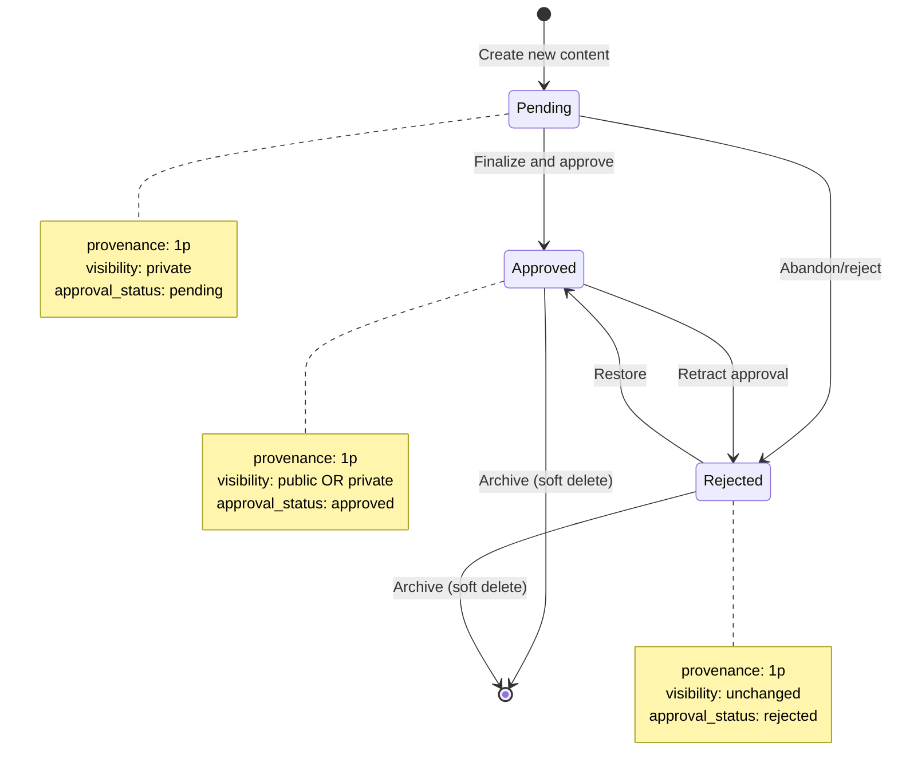
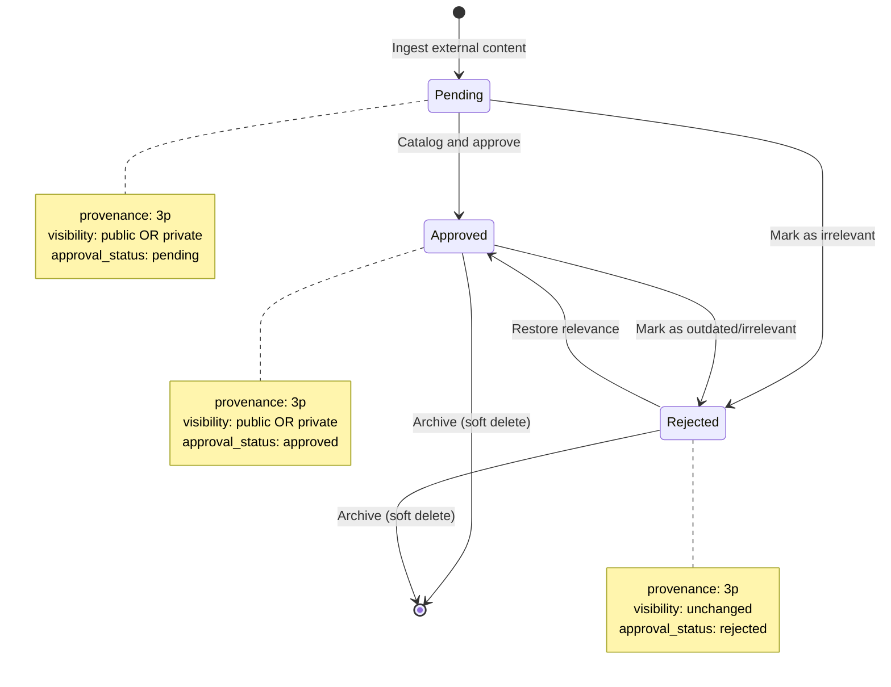
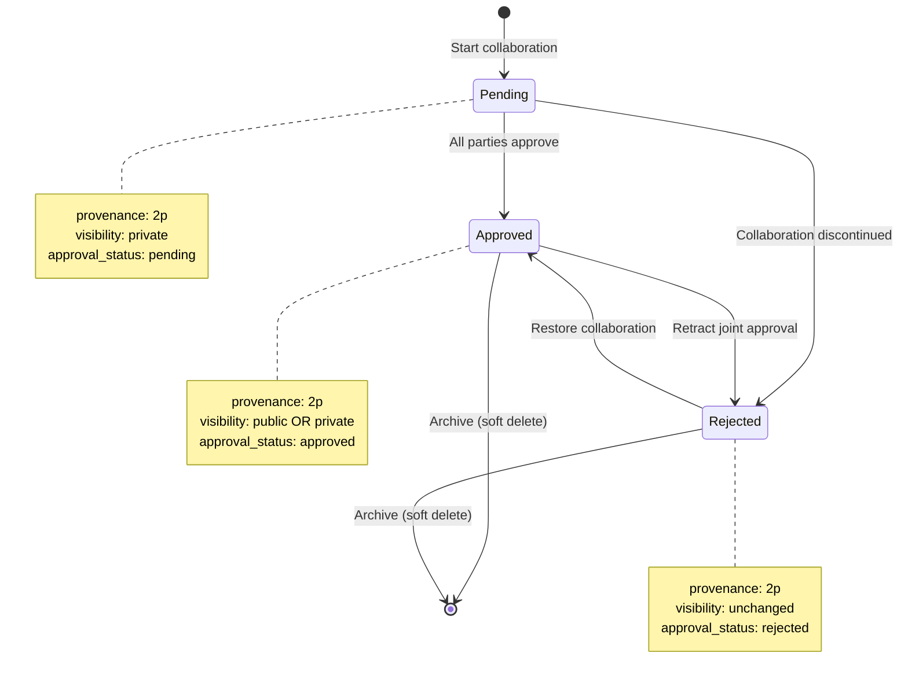
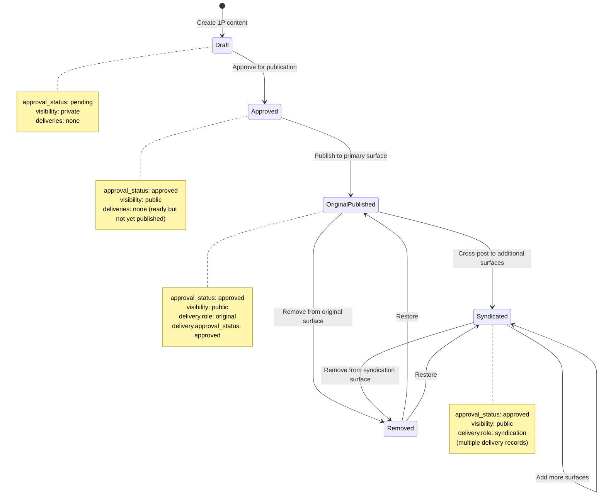
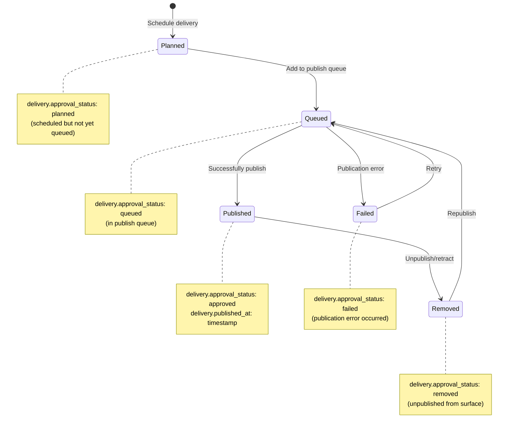

# Lifecycles

> **Version:** 2.0.0
> **Status:** active
> **Last Updated:** 2026-01-10
> **Provenance:** 1P (extends 3P)
> **Derives From:** dam, cms

Content state machines and workflow transitions in SemOps.

---

## Overview

This pattern extends industry-standard lifecycle patterns:

- **DAM (Digital Asset Management)** - Approval workflows (pending/approved/rejected)
- **CMS (Content Management Systems)** - Publication workflows (draft/published/archived)

This document defines the state machines and lifecycle workflows for content in SemOps. Different provenance types follow different lifecycle patterns, and the dual-status model (entity approval vs. delivery status) enables sophisticated publishing workflows.

**Key Concepts:**
- **Entity Lifecycle** - Approval status transitions (`pending` → `approved` → `rejected`)
- **Delivery Lifecycle** - Publication status (`planned` → `queued` → `published` → `failed` → `removed`)
- **Dual-Status Model** - Entity and delivery statuses are independent

---

## Adoption Context

- **Original Capability:** `publishing-pipeline` — lifecycle governance for published content
- **Problem Statement:** Content moves through states (draft, review, approved, published, archived) but lifecycle governance was implicit. Explicit state machine needed for audit trails and approval workflows.
- **Selection Criteria:** Standard CMS/DAM lifecycle pattern operationalized explicitly in SemOps via `approval_status` and `lifecycle_stage` fields on content entities.
- **ADR:** —

## 1P Content Lifecycle

**Applies to:** Content with `provenance=1p` (you created it)



### State Definitions

**Pending (Draft):**
- **Attributes:** `provenance=1p`, `approval_status=pending`, `visibility=private`
- **Meaning:** Content is being actively created or edited
- **Deliveries:** None (drafts are not delivered)
- **Transitions:**
  - → **Approved:** Content finalized and ready for use
  - → **Rejected:** Content abandoned or deemed unsuitable

**Approved (Published/Ready):**
- **Attributes:** `provenance=1p`, `approval_status=approved`, `visibility=public|private`
- **Meaning:** Content is finalized and approved for use
- **Deliveries:** May have delivery records (if published)
- **Transitions:**
  - → **Rejected:** Approval retracted (content no longer suitable)
  - → **Archived:** Content deprecated (soft delete)

**Rejected:**
- **Attributes:** `provenance=1p`, `approval_status=rejected`
- **Meaning:** Content deemed unsuitable or abandoned
- **Deliveries:** None (rejected content should not be delivered)
- **Transitions:**
  - → **Approved:** Content restored and approved
  - → **Archived:** Permanently removed

### Examples

**Draft → Approved:**
```json
// Initial state (draft)
{
  "id": "blog-draft-001",
  "provenance": "1p",
  "approval_status": "pending",
  "visibility": "private"
}

// After approval
{
  "id": "blog-draft-001",
  "provenance": "1p",
  "approval_status": "approved",
  "visibility": "public"  // Changed to public when ready
}
```

**Approved → Rejected (Retraction):**
```json
// Previously approved
{
  "id": "blog-post-001",
  "approval_status": "approved"
}

// Retracted (found error, outdated, etc.)
{
  "id": "blog-post-001",
  "approval_status": "rejected"
}
```

---

## 3P Content Lifecycle

**Applies to:** Content with `provenance=3p` (external party created it)



### State Definitions

**Pending (Staged for Review):**
- **Attributes:** `provenance=3p`, `approval_status=pending`
- **Meaning:** External content discovered but not yet cataloged
- **Use Case:** Content dropped in staging inbox awaiting review
- **Transitions:**
  - → **Approved:** Content reviewed and cataloged
  - → **Rejected:** Content deemed irrelevant or low-quality

**Approved (Cataloged):**
- **Attributes:** `provenance=3p`, `approval_status=approved`
- **Meaning:** External content cataloged and available for use
- **Use Case:** Research papers indexed in knowledge base, citations in blog posts
- **Transitions:**
  - → **Rejected:** Content becomes outdated or irrelevant
  - → **Archived:** Content no longer needed

**Rejected (Irrelevant):**
- **Attributes:** `provenance=3p`, `approval_status=rejected`
- **Meaning:** External content not suitable for catalog
- **Use Case:** Low-quality content, spam, irrelevant material
- **Transitions:**
  - → **Approved:** Reevaluated as relevant
  - → **Archived:** Permanently removed

### Examples

**Pending → Approved (Cataloging):**
```json
// External content staged for review
{
  "id": "arxiv-paper-staging",
  "provenance": "3p",
  "approval_status": "pending",
  "visibility": "private",
  "filespec": {
    "uri": "https://arxiv.org/abs/1234.5678"
  }
}

// After review and cataloging
{
  "id": "arxiv-paper-staging",
  "provenance": "3p",
  "approval_status": "approved",
  "visibility": "private",  // Indexed in knowledge base
  "metadata": {
    "content_type": "research_paper",
    "subject_area": ["AI/ML"]
  }
}
```

**Approved → Rejected (Outdated):**
```json
// Previously cataloged
{
  "id": "blog-reference-001",
  "provenance": "3p",
  "approval_status": "approved"
}

// Marked as outdated
{
  "id": "blog-reference-001",
  "provenance": "3p",
  "approval_status": "rejected"  // No longer relevant
}
```

---

## 2P Content Lifecycle

**Applies to:** Content with `provenance=2p` (collaborative creation)



### State Definitions

**Pending (In Collaboration):**
- **Attributes:** `provenance=2p`, `approval_status=pending`, `visibility=private`
- **Meaning:** Content being created collaboratively
- **Use Case:** Co-authored research paper in progress, joint blog post draft
- **Transitions:**
  - → **Approved:** All parties approve final version
  - → **Rejected:** Collaboration discontinued

**Approved (Published Together):**
- **Attributes:** `provenance=2p`, `approval_status=approved`
- **Meaning:** Collaborative content finalized and approved by all parties
- **Use Case:** Published co-authored paper, shared repository
- **Transitions:**
  - → **Rejected:** Joint approval retracted
  - → **Archived:** Content deprecated

**Rejected:**
- **Attributes:** `provenance=2p`, `approval_status=rejected`
- **Meaning:** Collaboration discontinued or retracted
- **Transitions:**
  - → **Approved:** Collaboration restored
  - → **Archived:** Permanently removed

---

## Multi-Surface Publishing Flow

**Focus:** How 1P content moves through original publication and syndication



### Publication States

**Draft:**
- **Entity Status:** `approval_status=pending`
- **Deliveries:** None
- **Next Steps:** Approve for publication

**Approved (Ready):**
- **Entity Status:** `approval_status=approved`
- **Deliveries:** None yet
- **Next Steps:** Publish to primary surface

**Original Published:**
- **Entity Status:** `approval_status=approved`
- **Deliveries:** One delivery with `role=original`
- **Next Steps:** Optionally syndicate to additional surfaces

**Syndicated:**
- **Entity Status:** `approval_status=approved`
- **Deliveries:** Original + N syndication deliveries
- **Next Steps:** Add more syndications or remove from surfaces

### Example Workflow

```json
// Step 1: Draft
{
  "id": "blog-post-001",
  "provenance": "1p",
  "approval_status": "pending",
  "visibility": "private"
}

// Step 2: Approved (ready to publish)
{
  "id": "blog-post-001",
  "provenance": "1p",
  "approval_status": "approved",
  "visibility": "public"
}

// Step 3: Original publication
{
  "entity_id": "blog-post-001",
  "surface_id": "wordpress-blog",
  "role": "original",
  "approval_status": "approved",
  "url": "https://myblog.com/post"
}

// Step 4: Syndication 1
{
  "entity_id": "blog-post-001",
  "surface_id": "medium",
  "role": "syndication",
  "approval_status": "approved",
  "url": "https://medium.com/@me/post"
}

// Step 5: Syndication 2
{
  "entity_id": "blog-post-001",
  "surface_id": "linkedin",
  "role": "syndication",
  "approval_status": "approved",
  "url": "https://linkedin.com/articles/post"
}
```

---

## Delivery Lifecycle (Independent)

**Focus:** Status of individual delivery records (independent of entity approval status)



### Delivery States

**Planned:**
- **Meaning:** Delivery scheduled but not yet queued
- **Use Case:** Content scheduled for future publication
- **Next States:** Queued, Canceled

**Queued:**
- **Meaning:** Delivery in publish queue
- **Use Case:** Awaiting publication to surface
- **Next States:** Published, Failed

**Published:**
- **Meaning:** Successfully published to surface
- **Attributes:** Has `published_at` timestamp
- **Next States:** Removed

**Failed:**
- **Meaning:** Publication attempt failed
- **Use Case:** API error, validation failure, network issue
- **Next States:** Queued (retry), Canceled

**Removed:**
- **Meaning:** Unpublished from surface
- **Use Case:** Content retracted, expired, or manually removed
- **Next States:** Queued (republish)

---

## Dual-Status Model

**Key Insight:** Entity approval status and delivery status are independent.

### Possible Combinations

| Entity Approval | Delivery Status | Valid? | Use Case |
|----------------|-----------------|--------|----------|
| `pending` | None | ✅ Yes | Draft in progress |
| `pending` | Any | ❌ No | Drafts should not be delivered |
| `approved` | None | ✅ Yes | Approved but not yet published |
| `approved` | `planned` | ✅ Yes | Scheduled for publication |
| `approved` | `queued` | ✅ Yes | In publish queue |
| `approved` | `approved` (published) | ✅ Yes | Live on surface |
| `approved` | `failed` | ✅ Yes | Publication attempt failed |
| `approved` | `removed` | ✅ Yes | Unpublished from surface |
| `rejected` | None | ✅ Yes | Rejected content |
| `rejected` | Any | ❌ No | Rejected content should not be delivered |

### Examples

**Approved but Not Yet Published:**
```json
// Entity is approved
{
  "id": "blog-post-001",
  "approval_status": "approved"
}

// No delivery records yet - this is valid!
// Content is ready but hasn't been published anywhere
```

**Approved and Live on Multiple Surfaces:**
```json
// Entity is approved
{
  "id": "blog-post-001",
  "approval_status": "approved"
}

// Delivery 1: Published
{
  "entity_id": "blog-post-001",
  "surface_id": "wordpress",
  "approval_status": "approved"
}

// Delivery 2: Queued
{
  "entity_id": "blog-post-001",
  "surface_id": "medium",
  "approval_status": "queued"
}

// Delivery 3: Failed
{
  "entity_id": "blog-post-001",
  "surface_id": "linkedin",
  "approval_status": "failed"
}
```

---

## Related Documentation

- [publication-patterns.md](publication-patterns.md) - Workflow patterns in detail
- [reference-entity-constraints.md](reference-entity-constraints.md) - Validation rules and invalid state combinations
- [UBIQUITOUS_LANGUAGE.md](../../schemas/UBIQUITOUS_LANGUAGE.md) - Status field definitions

---

## 3P Foundation

| Standard | What We Adopt | Our Extension |
|----------|---------------|---------------|
| **DAM** | Approval workflow states | Added 1P/2P/3P provenance-based transitions |
| **CMS** | Draft/Published/Archived | Added dual-status (entity + delivery) model |

**Key Extension:** The **Dual-Status Model** separates entity approval from delivery status, enabling approved content to exist in various publication states across multiple surfaces.

