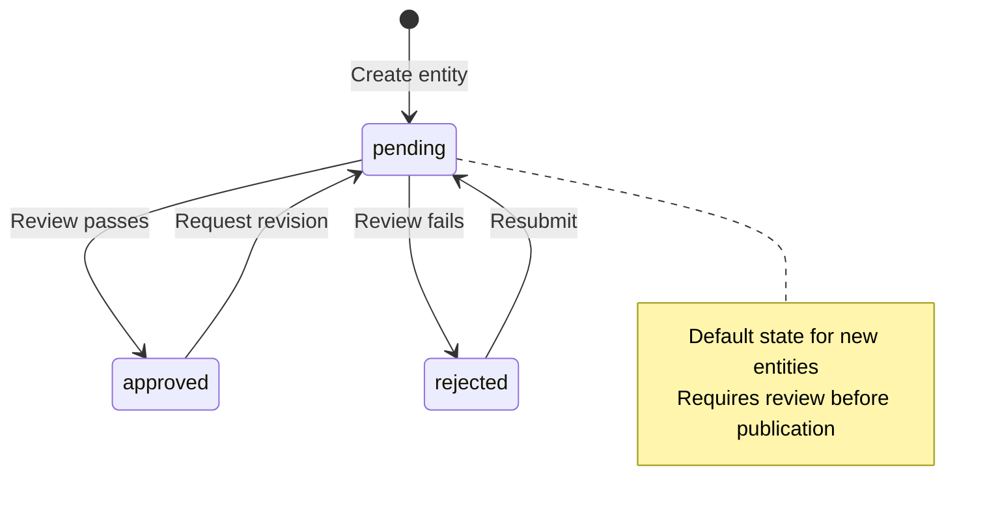

# Schema Documentation Style Guide

> **Version:** 1.0.1
> **Status:** active
> **Last Updated:** 2026-01-10
> **Provenance:** 1P
> **Derives From:** Repository documentation best practices

This guide covers conventions specific to **schema and entity documentation** in semops-core. For general documentation style (headings, lists, emphasis, etc.), see the [Technical Docs Style Guide](https://github.com/semops-ai/semops-publisher/blob/main/style-guides/technical.md).

---

## Adoption Context

- **Original Capability:** `publishing-pipeline` — consistent documentation quality
- **Problem Statement:** Style guides are ad-hoc — each document differs in structure, examples, and terminology conventions. No canonical template for documentation quality across repos.
- **Selection Criteria:** Establish consistent doc structure (headings, sections, examples, references) as a reusable guide. Enables both human and agent-authored documentation to meet quality standards.
- **ADR:** —

## Scope

This document covers:
- JSON/YAML entity examples
- Validation rule formatting
- State machine diagrams
- Schema field naming conventions
- Entity catalog structure

For content authoring conventions (frontmatter, citations, Related Links), see the [Technical Docs Style Guide](https://github.com/semops-ai/semops-publisher/blob/main/style-guides/technical.md).

---

## Schema Terminology

Use exact field names from [UBIQUITOUS_LANGUAGE.md](../../schemas/UBIQUITOUS_LANGUAGE.md):

| Use This | Not This |
|----------|----------|
| `approval_status` | "status" or "approval" |
| `asset_type` | "type" |
| `provenance` | "source" or "origin" |
| `visibility` | "access level" |
| `primary_concept` | "concept" or "topic" |
| `content_type` | "document type" |

**Key distinctions:**
- **Entity** (not "object" or "record")
- **Edge** (not "relationship" when referring to the table)
- **Surface** (not "platform" or "channel")
- **Delivery** (not "publication" when referring to the entity)

---

## JSON/YAML Examples

### Structure

Provide complete, valid examples with all required fields:

```json
{
  "id": "blog-post-semantic-operations-intro",
  "asset_type": "file",
  "provenance": "1p",
  "approval_status": "approved",
  "visibility": "public",
  "filespec": {
    "$schema": "filespec_v1",
    "uri": "https://github.com/semops-ai/semops-docs/blob/main/docs/Publicv1_Candidates/SEMOPS_FRAMEWORK/README.md",
    "format": "markdown",
    "platform": "github"
  },
  "attribution": {
    "$schema": "attribution_v1",
    "authors": ["Tim Mitchell"],
    "license": "CC-BY-4.0"
  },
  "metadata": {
    "$schema": "content_metadata_v1",
    "content_type": "github_doc",
    "primary_concept": "semantic-operations",
    "preferred_label": "Semantic Operations",
    "broader_concepts": ["dikw", "domain-driven-design"]
  }
}
```

### YAML Entity Catalogs

For entity catalogs (like [foundation-entity-catalog.yaml](../foundation/foundation-entity-catalog.yaml)), use this structure:

```yaml
entities:
  entity-id:
    entity_id: entity-id
    title: "Human-Readable Title"
    version: "1.0"
    asset_type: file
    provenance: 1p
    approval_status: approved
    visibility: public

    filespec:
      $schema: filespec_v1
      uri: "https://github.com/..."
      format: markdown
      platform: github

    attribution:
      $schema: attribution_v1
      authors: ["Author Name"]
      license: "CC-BY-4.0"

    metadata:
      $schema: content_metadata_v1
      content_type: github_doc
      primary_concept: concept-id
      preferred_label: "Concept Name"
      broader_concepts: [parent-concept]
      narrower_concepts: [child-concept]

    edges:
      - destination_id: related-entity
        predicate: depends_on
        strength: 1.0
```

### Best Practices

- Include `$schema` field in all JSONB value objects
- Use realistic IDs that reflect the pattern (kebab-case)
- Show related edges when they clarify the pattern
- Include optional fields only when they add clarity

---

## Validation Rules

Use consistent format for validation rules:

```
IF condition THEN requirement
IF condition THEN requirement

FOR EACH entity:
  COUNT(deliveries WHERE role = "original") <= 1
```

**Example:**
```
IF provenance = "3p" THEN approval_status IN ("pending", "approved", "rejected")
IF visibility = "private" THEN surface.direction != "publish"
```

This format makes rules scannable and testable.

---

## State Machine Diagrams

Use Mermaid for entity lifecycle transitions:



Include notes showing relevant attribute values for each state.

---

## Edge Predicates

When documenting edges, use the standard predicate vocabulary from [UBIQUITOUS_LANGUAGE.md](../../schemas/UBIQUITOUS_LANGUAGE.md#edge-predicates):

| Predicate | Use For |
|-----------|---------|
| `depends_on` | Foundational requirements |
| `cites` | Academic/authoritative references |
| `derived_from` | Transformation lineage |
| `related_to` | Non-hierarchical associations |
| `part_of` | Component relationships |
| `implements` | Abstract → concrete |
| `version_of` | Version lineage |

Always include `strength` (0.0-1.0) to indicate relationship significance.

---

## Quality Checklist

Before committing schema documentation:

- [ ] JSON/YAML examples are valid and complete
- [ ] All `$schema` fields present in value objects
- [ ] Schema field names match exactly (use `approval_status`, not "status")
- [ ] Edge predicates use standard vocabulary
- [ ] Entity IDs follow kebab-case convention
- [ ] Cross-references to UBIQUITOUS_LANGUAGE.md included
- [ ] Mermaid diagrams render correctly

---

## Related Documentation

- [UBIQUITOUS_LANGUAGE.md](../../schemas/UBIQUITOUS_LANGUAGE.md) - Core term definitions
- [phase1-schema.sql](../../schemas/phase1-schema.sql) - Database schema
- [Foundation Entity Catalog](../foundation/foundation-entity-catalog.yaml) - Golden sample

### Style Guides (semops-publisher)

| Guide | Purpose |
|-------|---------|
| [technical.md](https://github.com/semops-ai/semops-publisher/blob/main/style-guides/technical.md) | Voice + formatting for technical documentation |
| [blog.md](https://github.com/semops-ai/semops-publisher/blob/main/style-guides/blog.md) | Voice for blog posts and social content |
| [whitepaper.md](https://github.com/semops-ai/semops-publisher/blob/main/style-guides/whitepaper.md) | Voice for whitepapers and thought leadership |

---

**Document Status:** Active | **Next Review:** 2025-12-23
**Maintainer:** SemOps Schema Team

